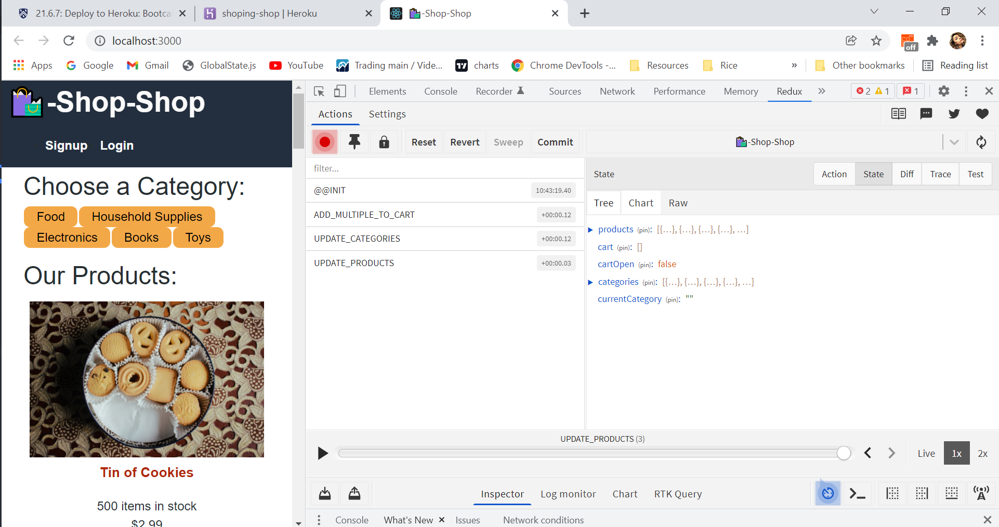

# shop-shop

## Description

This e-commerce application was created with React using Redux
to keep changes in the app more predictable and traceable. The transition was from React Global State to Redux.

## Table of Contents
* [Technologies](#technologies)
* [Testing](#testing)
* [Links](#links)
* [Authors](#authors)

##Technologies

-Node.js
-React

##Testing 

Testing was done on the localhost, browser devTools, redux extension.

##Links

Heroku: https://shoping-shop.herokuapp.com/

Github Repository: https://github.com/leslyr562/shop-shop.git

##Authors

- Lesly Gonzalez

